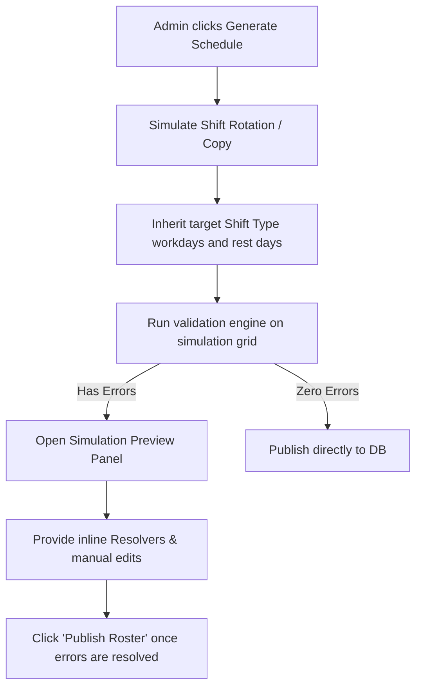

# Design Specification: Intelligent Shift Rotation & Schedule Inheritance

This document outlines the architecture, database adjustments, validation updates, and UI flow for the **Intelligent Shift Rotation & Schedule Inheritance Engine**.

---

## 1. Core Rule Specifications

### A. Rest Day Inheritance from Shift Type (Roster Line Model)
To maintain balanced coverage across rotation cycles, rest days (days off) are strictly tied to the shift type they are currently assigned to for that week:
*   **Default Behavior (Shift-Type Inheritance)**: When an employee rotates to a `ShiftType`, they automatically inherit that shift's workday pattern from its `daysOfWeek` config.
*   **Support for Same Shift, Different Day-offs (Shift Variants)**:
    If two employees are on the same daily shift hours (e.g. Day Shift 6AM–3PM) but have different day-offs, we define them as distinct **Shift Types** (or Roster Lines) in the settings:
    *   `DAY SHIFT A` (6:00 AM - 3:00 PM, off Tue/Wed)
    *   `DAY SHIFT B` (6:00 AM - 3:00 PM, off Thu/Fri)
*   **Rotation Paths**: Employees will rotate within their respective shift lines (Group A rotates through `A` shifts, Group B rotates through `B` shifts) to preserve staffing coverage:
    *   *Group A Path*: `DAY SHIFT A` → `MID SHIFT A` → `NIGHT SHIFT A` → `MIDNIGHT SHIFT A`
    *   *Group B Path*: `DAY SHIFT B` → `MID SHIFT B` → `NIGHT SHIFT B` → `MIDNIGHT SHIFT B`

### B. Updated Zamboanga Staffing Constraints
We will update the team-specific validation engine for Team **Zamboanga**:
1.  **Midnight Shift (Strict Gender Guard)**: If a female employee is scheduled for `MIDNIGHT SHIFT`, at least one **male employee** must be scheduled on the same shift on that day.
2.  **Night & Mid Shifts (General Companion Guard)**: If a female employee is scheduled on `NIGHT SHIFT` or `MID SHIFT`, at least one other companion of **any gender** must be scheduled on the same shift on that day.

### C. Weekly Workday Limits
*   **Max Consecutive Days**: Hard block at **6 days** (applies across week boundaries). Saving is prevented until resolved.
*   **Weekly Workdays**: Hard block at **5 days** per Monday-Sunday week.
*   **Weekly Rest Days**: Hard block at **2 rest days** minimum per week.

---

## 2. Technical Architecture & Database Schema

The database schema (`schema.prisma`) does not require new model extensions because the `ShiftType` already contains `daysOfWeek` to serve as the template:
*   We will ensure the UI and server actions allow duplicate time ranges under different custom shift names (e.g. `DAY SHIFT A` vs `DAY SHIFT B`) so the rotation paths can be configured separately in the Settings page.

---

## 3. The Pre-Flight Simulation & Rotation Flow

Instead of auto-saving the generated schedule directly to the database and throwing errors that revert changes, the schedule generation will follow an interactive simulation loop:

### Simulation Grid Visual Mockup (UI/UX)
When conflicts exist, the schedule page will display a **Simulation Workspace Banner** at the top:
> [!WARNING]
> **Roster Simulation has 2 critical conflicts.**
> Please resolve the conflicts below before publishing the schedule.
> *   *Alen Rose Dumalagan* works 8 consecutive days (June 26 to July 3).  `[Fix: Auto-Adjust Off Day]`
> *   *Janet Saldo* is alone on Zamboanga Midnight Shift on Monday.  `[Fix: Add Male Companion]`

---

## 4. Constraint Validation Modifications (`lib/schedulingValidation.ts`)

We will update [validateSchedule](file:///C:/Users/MarkTabotabo/AetasScheduler/lib/schedulingValidation.ts#L48) to:
1.  Modify the boundary checks to **only validate against the previous week (past schedules)**. Future schedule weeks (the next week) will not block saves of the current week.
2.  Enforce the updated Zamboanga `MIDNIGHT SHIFT` male-companion rule and `NIGHT/MID` shift general companion rules.
3.  Run validation checks in memory on the simulated updates *before* writing to the database.

---

## 5. Selective Rotation Controls
We will add a checkboxes drawer to the **"New Schedule Week"** modal:
*   Lists all rotating employees on the selected team.
*   Admin can check or uncheck individual employees.
*   Checked employees advance in the rotation sequence.
*   Unchecked employees retain their previous week's shift types.
